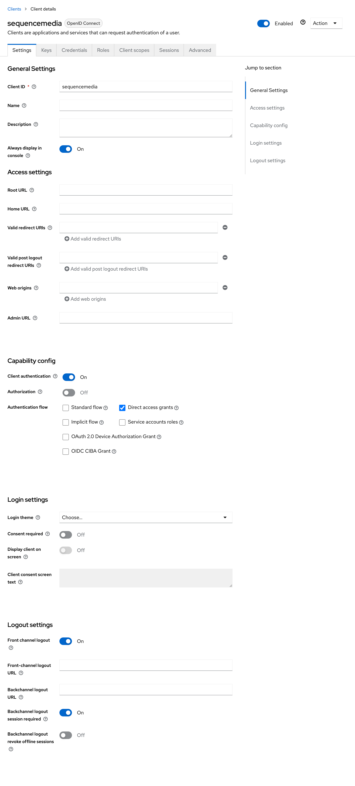
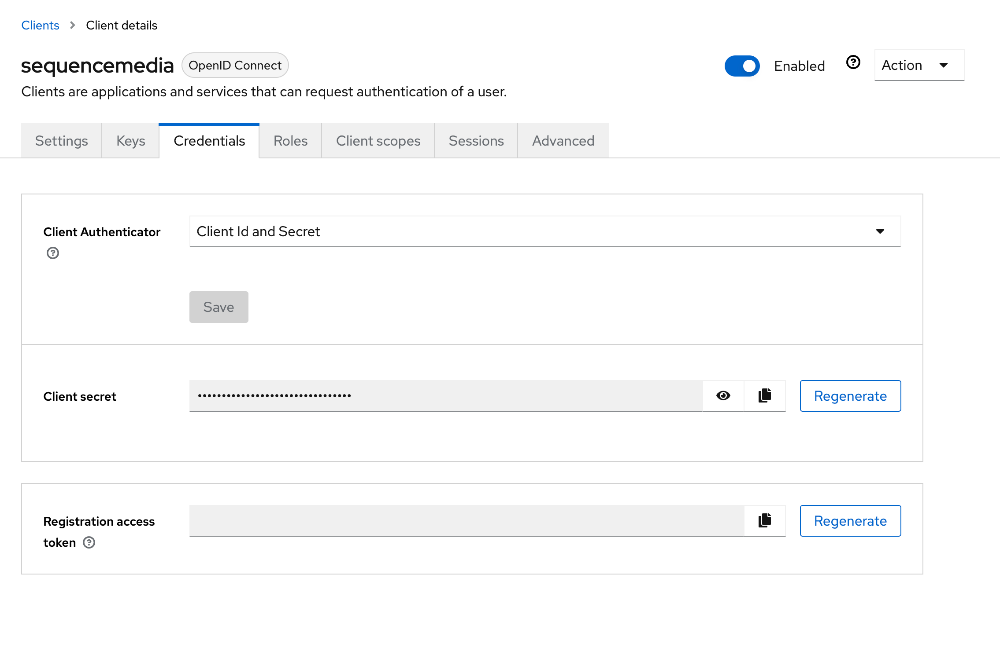

# the-keycloak

_Q_. Can we validate a user by making a request to Keycloak?

_A_. Yes

## Prerequisites

You'll need to have the latest version of Keycloak running locally and configured

In the _Settings_ tab I used the client ID `sequencemedia`  and enabled **client authentication** and **direct access grants** in the **Capability config** section (toward the bottom)

- Save the changes

In the _Credentials_ tab I regenerated the client secret  _which you should regenerate even though you have just created the client, because I spent four hours tracking down an issue so that you don't have to_

- Save the changes again

You should put your client ID into the JS

```
-d "client_id=<YOUR CLIENT ID>" \
```

And the client secret

```
-d "client_secret=${encodeURIComponent('<YOUR CLIENT SECRET>')}" \
```

I also created three users:

- `the-user-1`
- `the-user-2`
- `the-user-3`

I did't give them any permissions but you will need to amend the JS for your users, too

Wherever you see the `username` and `password` combination put a pair of credentials

```
-d "username=<USER NAME>" \
-d "password=${encodeURIComponent('<PASSWORD>')}"\
```

## To start

At the command line change into this directory and execute

```bash
npm run fetch
```

I initially wrote for `curl` to swap into the shell

```bash
npm run curl
```

I also tried a client package (it may not be the latest version)

```bash
npm run client
```

But it _poops_. It only seems to be `fetch`, but it breaks on passwords which need escaping. (It shouldn't be hard to put these `curl` requests into `fetch` without the bork)
